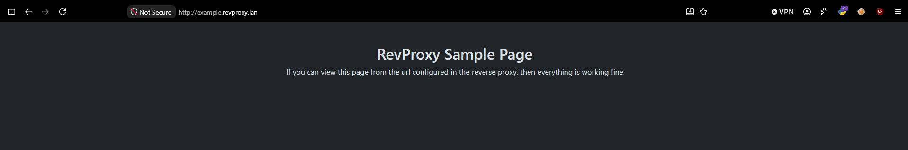

  
<h3 align="center">
  Simple, light and fast YAML based reverse proxy.  <br>
  Easily redirect requests to internal services, or private domains.
</h3> 

## Features

- **HTTPS support**:
  Rexy supports https if an SSL certificate is provided
- **Hot Reload**:
  Rexy will reload its configurations on the fly if you modify the configuration file 
- **Web view**:
  Rexy will create an html page on an url specified in the configuration file where you can monitor the domain mappings and search through them. 


## Usage
1. Start a simple http server (ex. `python3 -m http.server` or `bunx serve`) in the [sample website folder](./website/)
2. Complete the [`conf.yml`](./conf.yml) file with your own domain mappings (ex. `example.revproxy.lan` -> `localhost:8080`)
3. Run `go run . -conf ./conf.yml` to start Rexy and monitor the logs
4. Visit the configured URL in your browser (you may need to configure your DNS to point to Rexy)

you should see something like this


## Build Rexy from source
1. Make sure go >=1.23 is installed on the system
2. Run `go build -o rexy .` (`rexy.exe` on windows) 

> [!NOTE]  
> To make the `-version` flag work, compile rexy as  
> `go build -ldflags="-X 'main.version=$(git describe --tags --always)'" -o rexy .`

## Important notice
On linux, Rexy might not be able to bind to well-known ports by default, unless elevated provileges are given.  
To bind to those ports, the recomended way is to only allow this access, without giving it root privileges
```
sudo setcap 'cap_net_bind_service=+ep' /path/to/rexy
```
or for a service, you can append this string to your `rexy.service` file 
```
AmbientCapabilities=CAP_NET_BIND_SERVICE
```


